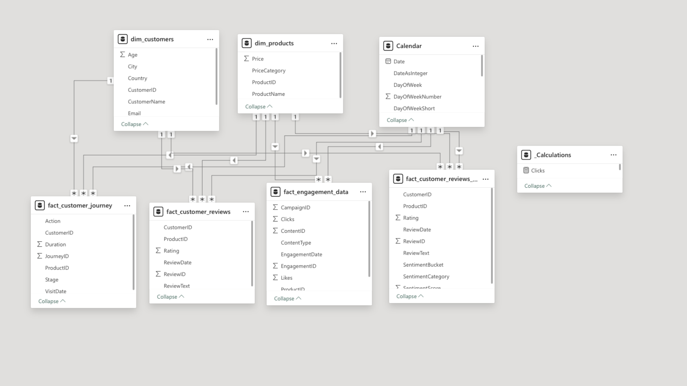
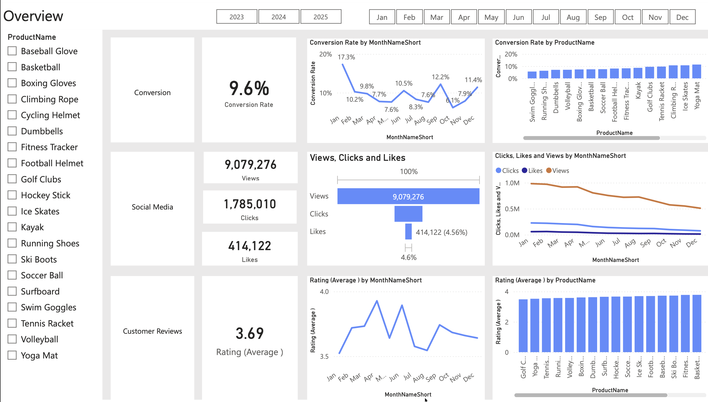
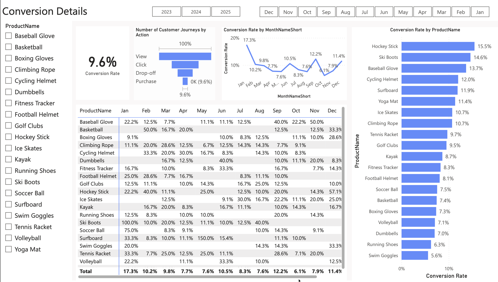
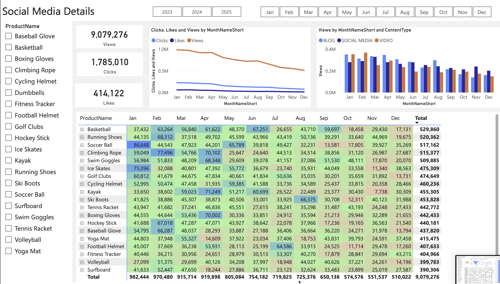
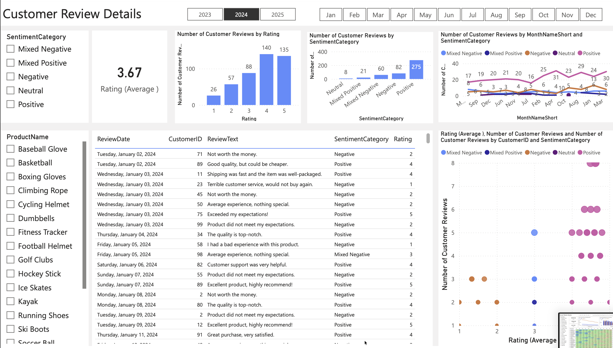

# Marketing Analytics Portfolio Project  
### SQL | Python | Power BI  

---

## Business Context

In competitive markets, marketing teams face three recurring challenges:

1. Fluctuating conversion rates across seasons
2. Declining customer engagement over time
3. Customer satisfaction scores that do not meet target benchmarks

This project replicates a real-world marketing analytics scenario where a company needs to diagnose performance issues across the conversion funnel, engagement channels, and customer feedback data.

---

## Business Problem

The organization observed:

- Significant variation in monthly conversion rates
- A noticeable decline in social media engagement in the second half of the year
- An average customer rating of 3.7, below the 4.0 target benchmark

These issues reflect common real-market challenges where marketing performance, customer experience, and brand perception directly impact revenue growth.

The goal was to:

- Identify drivers behind conversion fluctuations
- Analyze engagement trends across content types
- Extract insights from customer reviews using sentiment analysis
- Provide actionable recommendations to improve performance

---

## Approach & Methodology

### 1️⃣ Business Understanding & Requirement Gathering

- Defined key KPIs: Conversion Rate, CTR, Engagement Volume, Average Rating
- Aligned analysis with marketing performance objectives
- Structured problem into three analytical areas:
  - Conversion Performance
  - Engagement Analysis
  - Customer Sentiment Analysis

---

### 2️⃣ Data Cleaning & Transformation (SQL)

- Cleaned and structured fact and dimension tables
- Queried customer journey and engagement datasets
- Extracted monthly conversion trends
- Calculated CTR and performance metrics

SQL ensured structured, reliable datasets for downstream analysis.

---

### 3️⃣ Sentiment Analysis (Python)

- Performed advanced sentiment classification on customer reviews
- Categorized reviews into:
  - Positive (275)
  - Negative (82)
  - Mixed/Neutral
- Identified patterns contributing to lower ratings

This step helped bridge quantitative metrics with qualitative customer perception.

---

### 4️⃣ Dashboard Development (Power BI)

Built an interactive dashboard with:

- Monthly conversion trend analysis
- Engagement breakdown by content type
- KPI granularity with drill-down capability
- Sentiment distribution visualization

The dashboard was designed to support stakeholder-facing reporting.

---

## Key Insights

###  Conversion Performance
- Highest conversion rate: January (18.5%)
- Lowest conversion rate: May (4.3%)
- Strong recovery observed in December (10.2%)
- Seasonal demand significantly influenced product performance

**Real Market Parallel:**  
Seasonality and campaign timing often drive performance variability. Without intervention during low-performing months, revenue opportunity is lost.

---

### Customer Engagement
- Views peaked in February and July
- Engagement declined from August onward
- CTR remained healthy at 15.37%
- Blog content outperformed other formats

**Real Market Parallel:**  
High views with low interaction suggests content fatigue or weak call-to-action strategy.

---

### Customer Feedback & Sentiment
- Average rating: 3.7 (below 4.0 target)
- Majority of reviews were positive
- Mixed sentiment indicated opportunity for improvement

**Real Market Parallel:**  
Even small rating gaps (3.7 vs 4.0) significantly affect brand trust and purchase decisions.

---

## Recommended Actions

### Increase Conversion Rates
- Focus campaigns on high-performing categories
- Introduce targeted promotions during historically weak months
- Optimize conversion funnel drop-off stages

### Improve Engagement
- Experiment with interactive content formats
- Optimize CTA placement
- Re-engage audiences during declining months

### Enhance Customer Satisfaction
- Analyze recurring themes in mixed/negative reviews
- Implement feedback resolution loops
- Follow up with dissatisfied customers to improve retention

---

## Dashboard Preview

### Datamodelling

### Overview

### Conversion Details

### Social Media Details

### Customer Review Details

---

## Author

Geetha Sagar Bonthu
